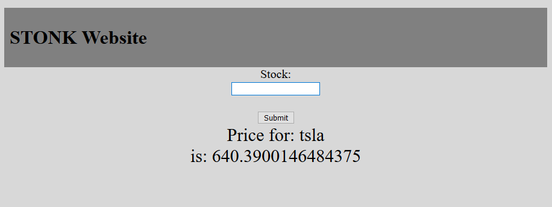
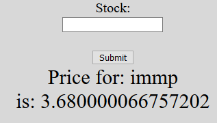
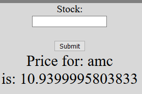
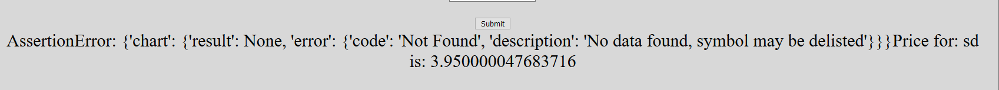

# Vagrant Dokumentation LB3
# Auftrag
Dies ist der Auftrag für die LB3. Wir haben das gleiche Projekt wie bei der LB2 gemacht, mit wenigen Änderungen an der Webseite. 
 
Wichtig: Es kann gut sein das es nicht funktionieren wird, leider weiss ich noch nicht warum.

# Aufbau
Anders als bei der LB2 benutzen wir ein Share um die Daten der Website dort zu speichern. Leider gibt es Probleme wenn man das ohne Linux Maschine macht, deswegen mussten wir es mit einer Vagrant VM machen.
 

## Webseite
Ähnlich wie beim ersten Projekt ist das 

    <?php
    if (isset($_POST['stock']))
    {
      $valor = $_POST['stock'];
    } 
    else{
      $valor = "Nothing";
    }
    if (preg_match("/[A-Z]/i",$valor)) {
      $myfile = fopen("./python/tmp/$valor", "w") or die("Unable to open file!");
      fclose($myfile);
      sleep(1);
      $valor_py = file_get_contents( "./python/tmp/stock.txt" );
      $price_py = file_get_contents( "./python/tmp/price.txt" );
    } else {
      $valor_py = "Not Set";
      $price_py = "Not Set";
    }
    ?>

## Phyton Script
Diese File kontrolliert die Datenübertragung vom Yahoo Finance Modul zur Webseite.

Hier werden die Daten vom Modul importiert

    import sys from yahoo_fin import stock_info as si

Hier werden die Wert aus der Datenbank herausgelesen und in die zugehörigen Files eingetragen

    price = si.get_live_price(stock) price_str = str(price) file_price = "/var/www/html/python/tmp/price" file_stock = "/var/www/html/python/tmp/stock"

Dieser Teil ist zuständig für den Preis von den Aktien

    with open(file_price, 'w') as fileowrite: fileowrite.write(price_str+"")

Dieser Teil ist zuständig für den Namen von den Aktien

    with open(file_stock, 'w') as fileowrite: fileowrite.write(stock+"")

## Dockerfile
Dies ist ein Simples Dockerfile. Es werden die Python Programme vorbereitet, und gestartet. Zusätzlich werden die Ports für die Webseite geöffnet

version: '3'

services:
  get-price:
    build: ./python
    volumes:
      - ./share/website/python:/usr/src/app
  
  website:
    build: ./website
    volumes:
      - ./share/website:/var/www/html
    ports:
      - 80:80
    depends_on:
      - get-price

## Testing
<h4>Testfall 1</h4>
Webseite via Docker-Compose aufrufen -- Funktioniert Teilweise
 
Manchmal funktioert es nicht. Leider ist der Grund noch unbekannt.

<h4>Testfall 2</h4>
Man kommt auf die Webseite und kann eine beliebige Aktie abfragen --- Funktioniert

<h4>Testfall 3</h4>
Man kann mehrere Abfrage nacheinander machen --- Funktioniert
 

<h4>Testfall 4</h4>
Falls eine nicht gültig Angabe gemacht wird, kommt eine Fehlermeldung --- Funktioniert
 

## Quellen
https://github.com/chrigi8902/m300_lb/blob/master/doku.md
https://gist.github.com/bergantine/8964657
https://stackoverflow.com/questions/43741552/create-virtual-hosts-in-vagrant-server
https://learn.hashicorp.com/tutorials/vagrant/getting-started-provisioning?in=vagrant/getting-started